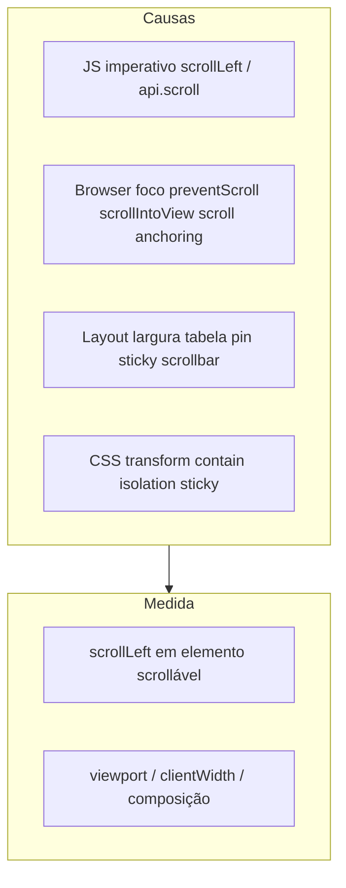
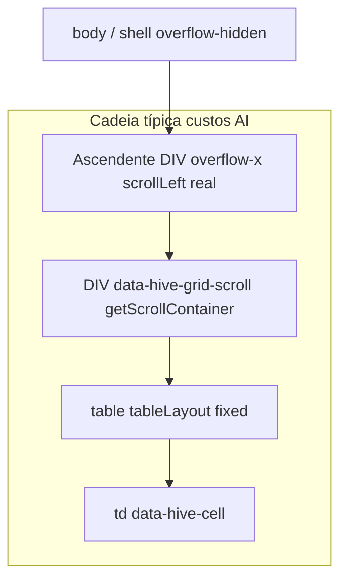

# Auditoria: movimento horizontal do scroll ao entrar em edição de linha («Editar»)

Este documento implementa o plano *mapear causas de movimento horizontal do scroll ao clicar «Editar»*: metodologia DOM, inventário de código (disparador → alvo → ficheiro), hipóteses só-CSS e decisão de desenho.

## 0. Modelo mental: duas famílias de «movimento»



- **Métrica «real»:** alteração de `scrollLeft` num elemento com `overflow-x: auto|scroll` (ou cadeia de vários).
- **Métrica «ilusória»:** `scrollLeft` estável mas o conteúdo **parece** saltar (sticky, subpixel, camada de composição).

## 1. Cadeia DOM (inspeção no browser)

### 1.1 Cenário fixo

- Ecrã: custos AI (ou outra grelha Hive com `editMode="row"`, `disableVirtualization`, `autoHeight`).
- Ações: scroll horizontal até colunas fora do início; clicar «Editar» na linha.

### 1.2 Script para colar na consola do DevTools

Executar **antes** do clique em Editar; repetir **depois** (ou usar duas abas de consola / copiar saída).

```javascript
(function () {
  const cell =
    document.querySelector("[data-hive-grid-scroll] [data-hive-cell]") ||
    document.querySelector("[data-hive-cell]");
  if (!cell) {
    console.warn("Nenhuma [data-hive-cell] encontrada.");
    return;
  }
  const rows = [];
  let el = cell;
  let depth = 0;
  while (el && el !== document.documentElement && depth < 40) {
    if (el instanceof HTMLElement) {
      const cs = getComputedStyle(el);
      const ox = cs.overflowX;
      const sw = el.scrollWidth;
      const cw = el.clientWidth;
      const scrollable =
        (ox === "auto" || ox === "scroll" || ox === "overlay") && sw > cw + 1;
      rows.push({
        depth,
        tag: el.tagName,
        scrollable,
        overflowX: ox,
        scrollLeft: el.scrollLeft,
        scrollW: sw,
        clientW: cw,
        hiveScroll: el.hasAttribute("data-hive-grid-scroll"),
        hiveGrid: el.classList?.contains?.("hive-data-grid") ?? false,
        role: el.getAttribute("role") || ""
      });
    }
    el = el.parentElement;
    depth++;
  }
  console.table(rows);
  return rows;
})();
```

**Leitura:** comparar `scrollLeft` nos nós com `scrollable: true` **antes** do clique, **logo após** o clique (mesmo frame se possível com breakpoint em `useLayoutEffect`), e após **dois** `requestAnimationFrame` encadeados.

### 1.3 Diagrama lógico (cadeia típica observada nas sessões de debug)

Evidência histórica: `getScrollContainer()` (nó `[data-hive-grid-scroll]`) pode reportar `scrollLeft === 0` no layout enquanto `snapshotHorizontalScrollAncestors(célula)` mostra um ascendente com `scrollLeft > 0` — **dois scrollports** na mesma árvore.



Nota: a ordem real (qual é «outer» vs `hiveScroll`) depende do DOM Proton; o script acima materializa a ordem por `depth`.

### 1.4 Metodologia de validação (passo a passo)

1. Congelar o cenário: custos AI (ou equivalente), `disableVirtualization`, `autoHeight`, scroll horizontal não trivial, clique «Editar».
2. Registar a cadeia com o script §1.2 (`tag`, `overflow-x`, `scrollWidth`, `clientWidth`, `scrollLeft`, `data-hive-grid-scroll`); repetir no mesmo frame que o `useLayoutEffect` (breakpoint) e após dois `requestAnimationFrame`.
3. Cruzamento com código: para cada nó scrollável, apontar para o ficheiro/linha que **escreve** `scrollLeft` ou **muda** largura/overflow (matriz §2).
4. Se todos os `scrollLeft` relevantes forem iguais antes/depois, tratar como salto **visual** (§4).

---

## 2. Matriz disparador → alvo DOM → código (inventário)

### 2.1 Hive — API e helpers

| Disparador | Alvo / efeito | Ficheiro (referência) |
|------------|----------------|------------------------|
| `api.scroll({ left })` / `scroll({ top })` | `scrollLeft` / `scrollTop` do `getScrollContainer()` | [createGridApi.ts](../core/x-data-grid/src/api/createGridApi.ts) ~271–275 |
| `scrollToIndexes` / `scrollToRow` | `scrollTop` + opcional `scrollLeft` por índice de coluna | [createGridApi.ts](../core/x-data-grid/src/api/createGridApi.ts) ~135–157, 277–287 |
| `setCellFocus` | `focus({ preventScroll: true })` + repin no `scrollEl` da API + repin opcional da **cadeia** (`horizontalScrollSnapshots`, pós‑foco e 1× `rAF`) | [createGridApi.ts](../core/x-data-grid/src/api/createGridApi.ts) `setCellFocus` |
| `snapshotHorizontalScrollAncestors` | Cadeia a partir de um `HTMLElement` (ex. célula), não só `getScrollContainer()` | [createGridApi.ts](../core/x-data-grid/src/api/createGridApi.ts) export ~91–113 |
| Restauro genérico | `restoreHorizontalScrollSnapshots(snap)` | [createGridApi.ts](../core/x-data-grid/src/api/createGridApi.ts) ~116–121 |

### 2.2 Hive — DataGrid (React)

| Disparador | Alvo / efeito | Ficheiro (referência) |
|------------|----------------|------------------------|
| Resolução do contentor de scroll | `scrollParentRef` (virtual) \| `scrollAreaRootRef` (autoHeight) \| Radix viewport \| raiz | [DataGrid.tsx](../core/x-data-grid/src/DataGrid.tsx) ~3849–3857 |
| Mudança `rowModesModel` → entrada em edição | `useLayoutEffect`: `restoreHorizontalScrollSnapshots(lastHorizontalScrollChainRef)` **antes** de `setCellFocus` | [DataGrid.tsx](../core/x-data-grid/src/DataGrid.tsx) ~4487–4557 |
| Captura de cadeia | `buildHorizontalScrollRestoreChain`: ascendentes horizontais da célula‑sonda **que envolvem ou estão dentro de** `getScrollContainer()` (inclui shell Proton à volta da grelha) | [DataGrid.tsx](../core/x-data-grid/src/DataGrid.tsx) ~165–198 |
| Qualquer `pointerdown` (capture) | Atualiza `lastHorizontalScrollChainRef` | [DataGrid.tsx](../core/x-data-grid/src/DataGrid.tsx) ~4479–4485 |
| `onScroll` / `onWheel` (rAF) em `NonVirtualGridBody` | Chama `syncGridScrollRefFromDom` → recaptura cadeia | [DataGrid.tsx](../core/x-data-grid/src/DataGrid.tsx) (corpo não virtual + ramo com scroll) |
| Div virtualizado (com scroll) | `onScroll` / `onWheel` + `syncGridScrollRefFromDom` | [DataGrid.tsx](../core/x-data-grid/src/DataGrid.tsx) (ramo `scrollParentRef`, ~5878+) |
| Mudança de página | `scrollTop = 0` no contentor (vertical; pode alterar presença de scrollbars / `clientWidth`) | [DataGrid.tsx](../core/x-data-grid/src/DataGrid.tsx) ~4574–4575 |
| Navegação teclado (Tab entre células) | `gridApi.scrollToIndexes` / `setCellFocus` | [DataGrid.tsx](../core/x-data-grid/src/DataGrid.tsx) ~4395, ~4207, ~4223, ~4401 |
| `onRowsScrollEnd` | Lê `scrollTop` / `clientHeight` (vertical) | [DataGrid.tsx](../core/x-data-grid/src/DataGrid.tsx) ~4901–4909 |

### 2.3 Layout / CSS (Hive)

| Disparador | Alvo / efeito | Ficheiro (referência) |
|------------|----------------|------------------------|
| Largura da `<table>` | `tableLayout: "fixed"`, `width: getTotalSize() (+160 se coluna ações integrada)` | [DataGrid.tsx](../core/x-data-grid/src/DataGrid.tsx) ~5474–5478 |
| Colunas pinned (corpo) | `position: sticky`, `transform: translateZ(0)`, `backfaceVisibility: hidden` | [DataGrid.tsx](../core/x-data-grid/src/DataGrid.tsx) ~1698–1725 |
| Linha em edição | classes `hive-data-grid-row--editing`, `ring-*` | [DataGrid.tsx](../core/x-data-grid/src/DataGrid.tsx) ~5595–5597 (ramo não virtual; também virtual ~6117) |
| Contentor não virtual | `overflow-auto` em `NonVirtualGridBody` | [DataGrid.tsx](../core/x-data-grid/src/DataGrid.tsx) ~287–310 |

### 2.4 ProtonWeb / envolvimento

| Disparador | Alvo / efeito | Ficheiro (referência) |
|------------|----------------|------------------------|
| Wrapper de tema custos | `hive-table-scope-purchase-sale` (`w-full`; sem overflow próprio na layer components) | [tailwind.css](../../../protonerp/src/front-end/ProtonWeb/src/styles/tailwind.css) ~294–296; [costs.tsx](../../../protonerp/src/front-end/ProtonWeb/src/submodules/operation/airimport/costs.tsx) ~1483 |
| Shell da app | `.hive-main-area`, `.main-component` com `overflow-hidden` | [tailwind.css](../../../protonerp/src/front-end/ProtonWeb/src/styles/tailwind.css) ~268–273 |
| Repasse de props para Hive | `StyledDataGridPro` → `DataGridPro` via `...rest` | [tableFunctions.tsx](../../../protonerp/src/front-end/ProtonWeb/src/utils/tableFunctions.tsx) ~436–500 |
| Duas colunas «Ações» | Coluna manual `type: "actions"` + coluna integrada `showRowEditActions` | [costs.tsx](../../../protonerp/src/front-end/ProtonWeb/src/submodules/operation/airimport/costs.tsx) ~769–822; [DataGrid.tsx](../core/x-data-grid/src/DataGrid.tsx) ~3801–3803 — mitigação: `showRowEditActions={false}` em custos |

### 2.5 Browser (sem código da app)

| Origem | Efeito possível |
|--------|------------------|
| Scroll anchoring (`overflow-anchor`) | Ajuste de `scrollTop` (e em casos limite percecionado como salto horizontal com layout composto). |
| Foco sem `preventScroll` noutro sítio | Scroll em qualquer scrollport focado. |
| Barras overlay (Windows) | `scroll` nem sempre alinhado com `pointerdown` — motivação para captura por célula/cadeia. |

---

## 3. Instrumentação opcional (fase 2 — só desenvolvimento)

Se o mapa manual não fechar o caso, usar **temporariamente** um listener de `scroll` em **capture** na `window` e filtrar por `event.target` com overflow scrollável (cuidado com custo; remover antes de produção):

```javascript
(function () {
  const seen = new WeakSet();
  const handler = (ev) => {
    const t = ev.target;
    if (!(t instanceof HTMLElement)) return;
    if (seen.has(t)) return;
    const ox = getComputedStyle(t).overflowX;
    if (
      (ox === "auto" || ox === "scroll" || ox === "overlay") &&
      t.scrollWidth > t.clientWidth + 1
    ) {
      console.log("[hive-scroll-debug]", {
        tag: t.tagName,
        left: t.scrollLeft,
        hiveScroll: t.hasAttribute("data-hive-grid-scroll")
      });
    }
  };
  window.addEventListener("scroll", handler, true);
  console.info("hive-scroll-debug: ativo; remover listener antes de commit.");
  return () => window.removeEventListener("scroll", handler, true);
})();
```

Se precisar de correlacionar com a app em desenvolvimento, usar o buffer `window.__hiveTableproObserveLog` (quando a observabilidade estiver ativa) ou breakpoints nos pontos da matriz §2.

---

## 4. Métrica real vs salto «visual»

Se **todos** os `scrollLeft` relevantes (cadeia do script §1) permanecem iguais antes/depois de Editar, considerar:

| Hipótese | Onde validar |
|----------|----------------|
| Sticky + composição (`translateZ(0)`) | Desativar temporariamente em DevTools a regra em `getPinnedStickyStyle` (body) e repetir Editar. |
| `ring-*` / altura da linha em edição | Toggle classe `hive-data-grid-row--editing` na linha e observar. |
| Subpixel / `table-layout: fixed` + redimensionamento de coluna | Comparar `getBoundingClientRect().left` de uma célula «âncora» no centro vs `scrollLeft`. |

---

## 5. Decisão de desenho

### 5.1 Problema estrutural

- A API expõe um único `getScrollContainer()` alinhado ao nó `[data-hive-grid-scroll]`.
- O utilizador (ou o browser) pode efetivamente deslocar conteúdo horizontalmente noutro scrollport **ascendente** ou **entre célula e esse nó**, o que torna `scrollLeft` desse nó uma métrica incompleta.

### 5.2 Opções

| Opção | Prós | Contras |
|-------|------|---------|
| **A — Um único scrollport (Proton + Hive)** | Sem ambiguidade; `getScrollContainer()` = scroll real. | Exige refatorar layouts que introduzem `overflow-x` extra à volta da grelha (shell, modais, painéis). |
| **B — Manter restauro multi-nó na Hive (atual)** | Tolerante a Pais com scroll; já alinhado com `snapshotHorizontalScrollAncestors` / `restoreHorizontalScrollSnapshots`. | `document` `pointerdown` em todas as instâncias; cadeia pode ficar stale em cenários só-teclado sem novo `pointerdown`. |
| **C — Alargar `getScrollContainer()`** | API devolve o nó «donativo» detectado heuristica­mente. | Heurística frágil (várias grelhas, Radix, virtual). |

### 5.3 Recomendação

1. **Curto prazo:** manter **B** e documentar que o **mapa de scroll horizontal** deve sempre considerar a **cadeia** (script §1), não só `getScrollContainer().scrollLeft`.
2. **Médio prazo:** em ecrãs Proton conhecidos (custos, pricing), **auditar** com o script se existe scrollport extra; se sim, preferir **A** (remover `overflow-x` duplicado no antecessor) para reduzir estado duplicado.
3. **API:** as funções `snapshotHorizontalScrollAncestors` e `restoreHorizontalScrollSnapshots` já são exportadas pelo pacote da API da grelha — ver [api/index.ts](../core/x-data-grid/src/api/index.ts). Consumidores que ajustem scroll manualmente devem preferir a **cadeia desde célula** em vez de assumir só `getScrollContainer()`.

---

## 6. Referências cruzadas

- Backlog geral DataGrid: [DATA_GRID_BACKLOG.md](./DATA_GRID_BACKLOG.md)
- Export público API (scroll): [api/index.ts](../core/x-data-grid/src/api/index.ts)
